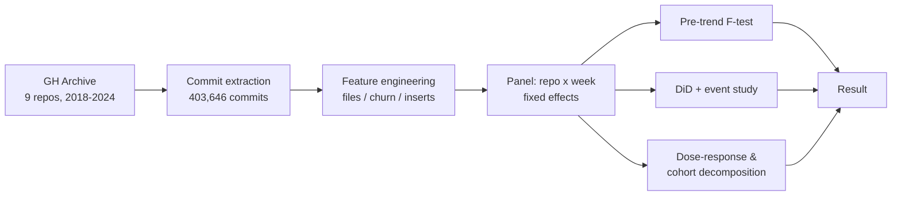
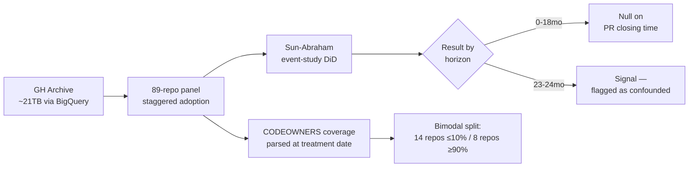
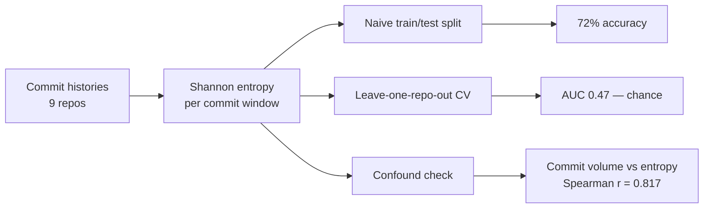
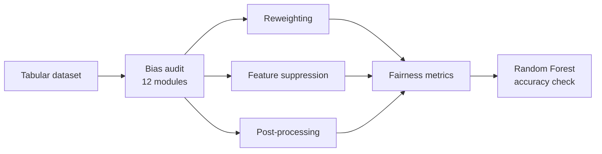
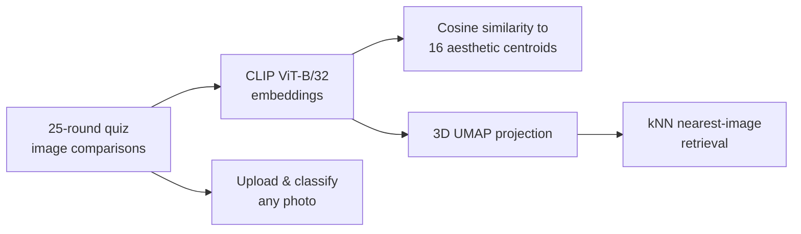

**Tanishk Gangwar**
B.Tech CSE (Data Science) · Manipal University Jaipur · Batch '28

---

I study how information behaves in code - in commits, in adoption curves, in systems that look chaotic until you measure them properly. Most of what's below started as a clean hypothesis. Some of it ended with the data winning instead of me. I think that's the more interesting outcome to publish.

---

## research

### [Sekivara](https://github.com/tanistheta/sekivara)
`difference-in-differences` `quasi-experimental` `git mining` `403k commits`

**Does GitHub Copilot change how people commit - causally, not just correlationally?**

| Metric | Effect | p-value |
|---|---|---|
| Mean files/commit | −28% | < 0.01 |
| Mean insertions/commit | −37% | < 0.01 |
| Large-commit fraction | −2.4pp | < 0.01 |
| Pre-trend joint F-test | passes on all 4 headline features | — |

Effect concentrates in existing contributors, not newcomers - people write smaller, more atomic commits once an assistant is doing the typing. HC3 robust SEs throughout; IEEEtran paper drafted, targeting MSR 2027.

<b>Relation to prior work</b> — Xu et al. 2025 (arXiv:2510.10165, Tilburg)

Xu et al. find Copilot adoption increases **PR-level rework and review volume**. Sekivara looks one level down, at the commit itself, and finds atomicity *decreasing* post-adoption. Together: **more, smaller, more frequent commits** — Sekivara supplies the commit-level mechanism underneath their PR-level result.

---

### [Ikiru](https://github.com/tanistheta/ikiru)
`staggered-adoption DiD` `sun-abraham estimator` `bigquery` `89 repos`

**Does adding a CODEOWNERS file causally change how fast pull requests get reviewed?**

| Window | Finding | Confidence |
|---|---|---|
| 0–18 months | Null effect on PR closing time | Clean |
| 23–24 months | Two coefficients turn significant | Confounded — only 17/28 repos reach this horizon, no later-adopting comparison cohort at same horizon |
| Coverage split | 14 repos ≤10% coverage, 8 repos ≥90% | High-coverage subset shows parallel-trends violation → likely moderator |

<b>Relation to prior work</b> — Lulla, Kula & Treude 2025

A directly competing paper was found mid-analysis and incorporated rather than ignored. Their fixed RDD design structurally cannot observe the 18–24 month window Ikiru covers — the two studies are complementary in the horizons they can each speak to, not redundant.

---

### [Entropic Fingerprint](https://github.com/tanistheta/entropic-fingerprint)
`shannon entropy` `leave-one-repo-out CV` `honest null result`

**Does Shannon entropy in commit histories predict upcoming software releases?**

| Evaluation | Result | Interpretation |
|---|---|---|
| Naive split | 72% accuracy | Looked promising |
| LORO-CV | AUC 0.47 | Indistinguishable from chance |
| Confound test | Spearman r = 0.817, p = 0.007 | Entropy was re-detecting commit volume, not release prep |

> **Status:** Published as a negative result with a documented confound, not a quiet repo nobody talks about. The methodology is the part worth reading.

---

### [Bias-Aware ML Pipeline](https://github.com/tanistheta/bias_awareness)
`fairness-aware ml` `demographic parity` `equal opportunity` `random forest`

**Does fixing bias in tabular ML cost accuracy - and do all mitigation strategies work equally well?**

| Strategy | Demographic Parity Gap ↓ | Equal Opportunity TPR Gap ↓ | Accuracy |
|---|---|---|---|
| Reweighting | Best of 3 | Best of 3 | Stable |
| Post-processing | Middle | Middle | Stable |
| Feature suppression | Worst of 3 | Worst of 3 | Stable |
| **Overall** | **64.5%** | **47.8%** | Held stable throughout |

The sharper finding: naive feature suppression - the most intuitive fix - was the *least* effective of the three, underperforming reweighting on every fairness axis tested. Built with Dr. Chirag Joshi; pending arXiv endorsement.

---

## open source

Contributions to libraries with real production surface area — not toy patches.

- **[pandas](https://github.com/pandas-dev/pandas)** — fixed a negative-slice indexer validation bug in core indexing logic using `slice.indices()` ([PR #66101](https://github.com/pandas-dev/pandas/pull/66101)), with regression tests.
- **[PyDriller](https://github.com/ishepard/pydriller)** — corrected `Commit._stats()` to respect the `skip_whitespaces` flag ([PR #320](https://github.com/ishepard/pydriller/pull/320)); added a `Commit.patch` property exposing full unified diffs, closing a long-standing feature request ([PR #321](https://github.com/ishepard/pydriller/pull/321)).
- **[PyGithub](https://github.com/PyGithub/PyGithub)** — added a configurable `max_rate_limit_wait` cap to `GithubRetry`, with a new `RateLimitExceededExceedsMaxWait` exception, replacing unbounded rate-limit stalls ([PR #3540](https://github.com/PyGithub/PyGithub/pull/3540)).

---

## builds

### [Kansei 感性](https://github.com/tanistheta/kansei) · [kansei.duckdns.org](https://kansei.duckdns.org/)
`clip` `umap` `fastapi` `docker` `gcp`

**Can a machine read taste?**

| Engineering problem | Root cause | Fix |
|---|---|---|
| Docker image bloat | pip dependency-resolution bug | 9.2GB → 1.62GB |
| Session tracking silently broken | Browser secure-context restriction | Diagnosed via evidence, not guesswork |
| Slow classify response | Assumed memory issue | Actually e2-micro's documented 25% sustained CPU ceiling — measured directly |
| Repeated slow startup | UMAP re-fit on every restart | Cached fit to disk |

Free-tier GCP VM (964MB RAM) by choice — the constraint is what makes the engineering real. Free HTTPS, a real domain, zero ongoing cost. Full writeup in the repo's README.

---

## stack

---

## achievements

- 🏆 Top **1,500 of 100,000+** participants - Google *"The Big Code"* competitive programming challenge

---

## stats

---

CGPA 9.00/10 · Manipal University Jaipur · Batch '28 · tanishk7531@gmail.com

