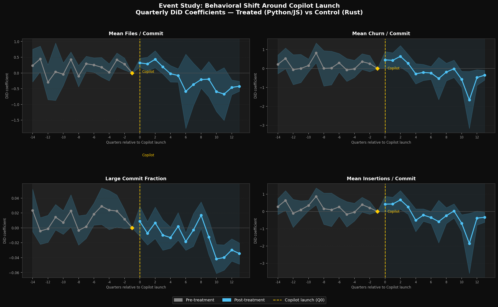
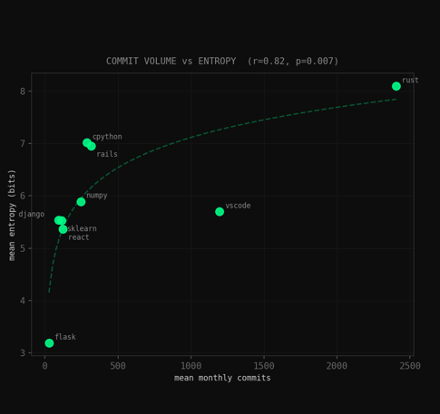

<div align="center">

[](https://tanishkgangwar.vercel.app/)

```
finding structure in things that look random
```

**Tanishk Gangwar** · MUJ CSE (Data Science) · Batch '28

[](https://tanishkgangwar.vercel.app/)
[](https://www.linkedin.com/in/tanishk-gangwar-809614363/)
[](mailto:tanishk7531@gmail.com)

</div>

---

I study how information behaves — in code, in commits, in systems that look chaotic until they aren't.
Most of my work starts with a clean hypothesis and ends with the data winning. That's fine. Rigorous negatives are underrated.

---

## research

<table>
<tr>
<td width="50%" valign="top">

### [Sekivara](https://github.com/tanistheta/sekivara)
`diff-in-diff` `quasi-experimental` `git`

Does GitHub Copilot leave a behavioral fingerprint in how people commit?

**Yes.** Across ~403k commits from 9 repositories, treated repos shifted toward smaller, more atomic commits after Copilot adoption. The effect is driven by **existing contributors** — not newcomers.



</td>
<td width="50%" valign="top">

### [Entropic Fingerprint](https://github.com/tanistheta/enthropic-fingerprint)
`shannon entropy` `AUC 0.47` `null result`

Does release preparation create detectable entropy spikes in Git histories?

**No.** Leave-one-out validation across 9 repos yields AUC 0.47 — chance. What the data *does* reveal: commit volume is the dominant structural signal (Spearman r = 0.817, p = 0.007).



</td>
</tr>
</table>

> Both published. Both honest.

---

## stack


---

## stats

<div align="center">


[](https://git.io/streak-stats)


</div>

---

<div align="center">
<sub>CGPA 9.00 · Manipal University Jaipur · tanishk7531@gmail.com</sub>
</div>